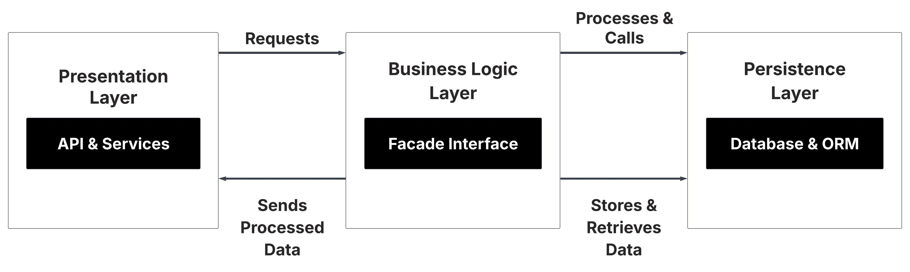
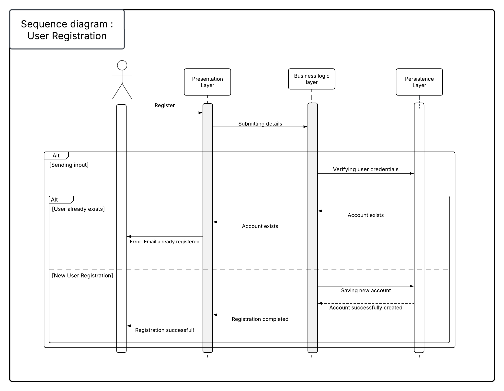

    <h1>
        HBnB Project - Introduction
    </h1>

<h2>1. Introduction</h2>
<h3>Purpose of the Document</h3>

This document serves as a comprehensive blueprint for the HBnB project, detailing its architecture, business logic, and API interactions. 
It provides a structured breakdown of the system, ensuring clarity and consistency for developers and stakeholders involved in the project.

<h3>Overview of HBnB Project</h3>

 HBnB is a web-based platform for short-term property rentals. The system facilitates property listings, user bookings, and reviews, ensuring 
    a seamless experience for hosts and guests. The document presents the architectural foundation of HBnB, outlining how different components 
    interact to create a scalable and maintainable system.

<h2>2. High-Level Architecture</h2>
 <h3>Overview</h3>
    

        The system follows a layered architecture with a Facade Pattern, ensuring modularity and separation of concerns. Each layer plays a crucial role:
    

    <ul>
        <li><strong>Presentation Layer</strong> – Manages user interactions via the web and API endpoints.</li>
        <li><strong>Business Logic Layer</strong> – Implements application logic, enforcing rules and validations.</li>
        <li><strong>Persistence Layer</strong> – Handles database interactions through ORM (Object-Relational Mapping).</li>
    </ul>
<h3>High-Level Package Diagram</h3>
    

    
    

This diagram showcases <strong>HBnB’s modular structure</strong>, emphasizing <strong>scalability</strong>,<strong> reusability</strong>, and <strong>maintainability</strong>.

<h2>3. Business Logic Layer</h2>
<h3>Overview</h3>

The Business Logic Layer is responsible for enforcing application rules, data integrity, and managing interactions between users, places, reviews, and amenities.

<h3>Detailed Class Diagram</h3>

<h3>Key Components</h3>
<ul>
        <li><strong>Facade Interface</strong> – Provides a unified API for managing users, places, reviews, and amenities.</li>
        <li><strong>User</strong> – Represents registered users, storing details like name, email, and hashed password.</li>
        <li><strong>Place</strong> – Stores property details such as name, description, location, pricing, and guest capacity.</li>
        <li><strong>Review</strong> – Allows users to submit reviews for places, including ratings and feedback.</li>
        <li><strong>Amenity</strong> – Represents additional features available for a place (e.g., WiFi, pool, gym).</li>
    </ul>
<h3>Design Decisions</h3>
<ul>
        <li><strong>Encapsulation of Business Logic</strong>: Each entity manages its own rules and constraints.</li>
        <li><strong>UUIDs for Unique Identification</strong>: Ensures global uniqueness across distributed environments.</li>
        <li><strong>Implementation of Facade Pattern</strong>: Simplifies interactions by providing high-level APIs.</li>
        <li><strong>Data Integrity and Validation</strong>: Input data is strictly validated before storage.</li>
    </ul>
<h2>4. API Interaction Flow</h2>
<h3>Overview</h3>

The HBnB API enables efficient communication between the frontend and backend, supporting CRUD operations for users, places, reviews, and amenities.

<h4>1. User Registration: A new user signs up for an account.</h4>

    

When the user submits their registration details, the API first validates the input to ensure that it meets the required criteria. Once validated, the data is forwarded to the Business Logic Layer, where it is checked for uniqueness. If the information is valid and unique, the user record is then saved to the database. Finally, based on the validation and storage results, the API sends a response, either confirming success or providing an error message.

<h4>2. Place Creation: A user creates a new place listing.</h4>

    

When the user submits the details of a place, the API forwards the request to the Business Logic Layer for validation. The Business Logic Layer checks the user's existence and, if valid, proceeds to insert the new place record into the database. Once the process is complete, the API returns a response, either confirming the successful addition of the place or providing an error message if any issues arise.

<h4>3. Review Submission: A user submits a review for a place</h4>

    

When the user submits a review along with the place ID, the API first validates the request before forwarding it to the Business Logic Layer. The Business Logic Layer checks the existence of both the user and the place, and if everything is valid, it stores the review in the database. Afterward, the API sends a response, either confirming the review's successful submission or providing an error message if any issues occur.

<h4>4. Fetching a List of Places: A user requests a list of available places.</h4>

    

When the user requests places with specific filters, the API forwards the request to the Business Logic Layer for filtering and validation. The Business Logic Layer then retrieves the places that match the given filters from the database. Finally, the API returns the list of filtered places to the user.

<h2>5. Conclusion</h2>

This document offers a comprehensive and well-structured overview of the HBnB system architecture, with a particular focus on the core business logic and seamless API interactions. Through detailed diagrams and in-depth explanations, it provides valuable insights that serve as a practical reference for developers. The information presented ensures a clear understanding of the system's design, facilitating an efficient and smooth implementation process while maintaining scalability and consistency across the platform.

