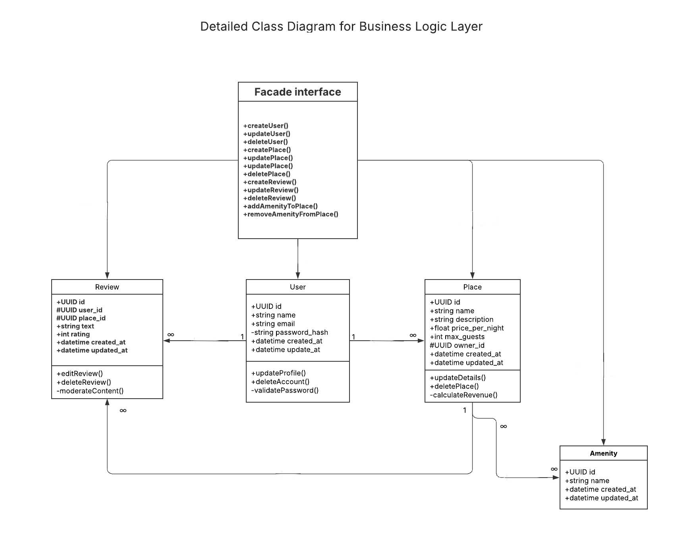
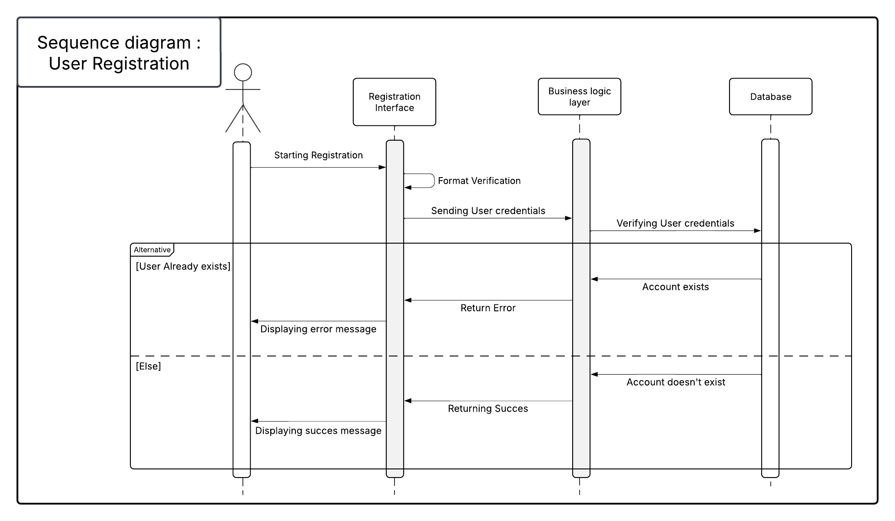
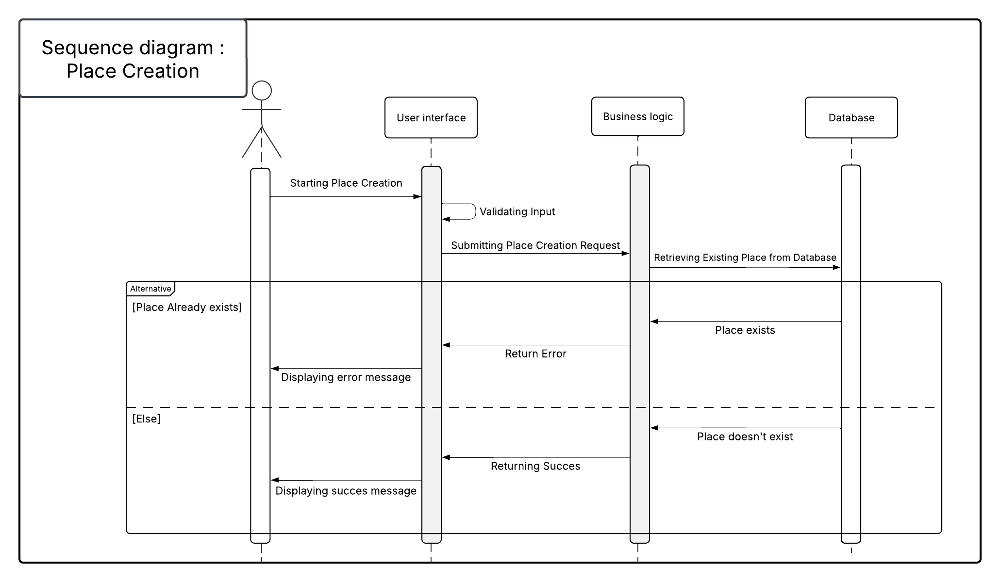
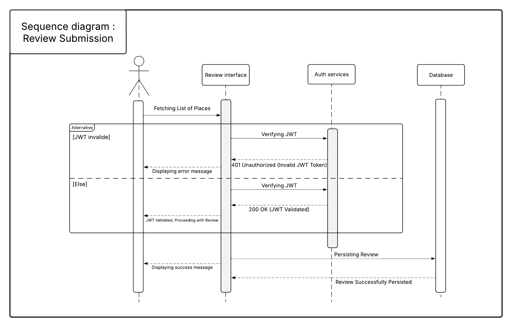
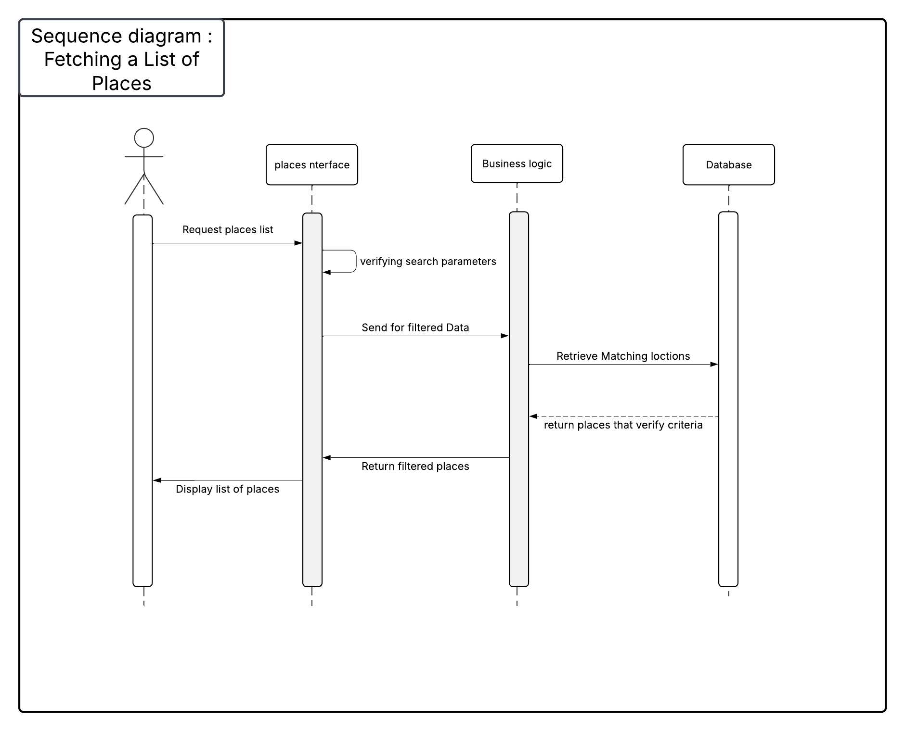

    <h1>
        HBnB Project - Introduction
    </h1>

<h2>1. Introduction</h2>
<h3>Purpose of the Document</h3>

This document serves as a comprehensive blueprint for the HBnB project, detailing its architecture, business logic, and API interactions. 
It provides a structured breakdown of the system, ensuring clarity and consistency for developers and stakeholders involved in the project.

<h3>Overview of HBnB Project</h3>

 HBnB is a web-based platform for short-term property rentals. The system facilitates property listings, user bookings, and reviews, ensuring 
    a seamless experience for hosts and guests. The document presents the architectural foundation of HBnB, outlining how different components 
    interact to create a scalable and maintainable system.

<h2>2. High-Level Architecture</h2>
 <h3>Overview</h3>
    

        The system follows a layered architecture with a Facade Pattern, ensuring modularity and separation of concerns. Each layer plays a crucial role:
    

    <ul>
        <li><strong>Presentation Layer</strong> – Manages user interactions via the web and API endpoints.</li>
        <li><strong>Business Logic Layer</strong> – Implements application logic, enforcing rules and validations.</li>
        <li><strong>Persistence Layer</strong> – Handles database interactions through ORM (Object-Relational Mapping).</li>
    </ul>
<h3>High-Level Package Diagram</h3>
    

    
    

This diagram showcases <strong>HBnB’s modular structure</strong>, emphasizing <strong>scalability</strong>,<strong> reusability</strong>, and <strong>maintainability</strong>.

<h2>3. Business Logic Layer</h2>
<h3>Overview</h3>

The Business Logic Layer is responsible for enforcing application rules, data integrity, and managing interactions between users, places, reviews, and amenities.

<h3>Detailed Class Diagram</h3>
    

    
    

<h3>Key Components</h3>
<ul>
        <li><strong>Facade Interface</strong> – Provides a unified API for managing users, places, reviews, and amenities.</li>
        <li><strong>User</strong> – Represents registered users, storing details like name, email, and hashed password.</li>
        <li><strong>Place</strong> – Stores property details such as name, description, location, pricing, and guest capacity.</li>
        <li><strong>Review</strong> – Allows users to submit reviews for places, including ratings and feedback.</li>
        <li><strong>Amenity</strong> – Represents additional features available for a place (e.g., WiFi, pool, gym).</li>
    </ul>
<h3>Design Decisions</h3>
<ul>
        <li><strong>Encapsulation of Business Logic</strong>: Each entity manages its own rules and constraints.</li>
        <li><strong>UUIDs for Unique Identification</strong>: Ensures global uniqueness across distributed environments.</li>
        <li><strong>Implementation of Facade Pattern</strong>: Simplifies interactions by providing high-level APIs.</li>
        <li><strong>Data Integrity and Validation</strong>: Input data is strictly validated before storage.</li>
    </ul>
<h2>4. API Interaction Flow</h2>
<h3>Overview</h3>

The HBnB API enables efficient communication between the frontend and backend, supporting CRUD operations for users, places, reviews, and amenities.

<h4>1. User Registration: A new user signs up for an account.</h4>

    

    This sequence diagram outlines the user registration process by illustrating the interactions between the key components:

<ul>
    <li><strong>User</strong>: Initiates the registration request.</li>
    <li><strong>Registration Interface</strong>: Receives the user's input and first conducts a format verification to ensure the data meets the required standards.</li>
    <li><strong>Business Logic Layer</strong>: Takes the verified credentials and communicates with the database to determine if the user already exists.</li>
    <li><strong>Database</strong>:
        <ul>
            <li><strong>Existing Account</strong>: Returns an error indicating that the user already exists, leading the business logic to relay an error message back to the registration interface, which then informs the user.</li>
            <li><strong>New Account</strong>: Confirms that no such account exists, prompting the business logic layer to proceed with registration. The success feedback is sent back to the registration interface which then displays a success message to the user.</li>
        </ul>
    </li>
</ul>

    The diagram effectively showcases the alternate paths to handle both error scenarios (duplicate account) and successful registrations, ensuring robust management of the user registration process.

<h4>2. Place Creation: A user creates a new place listing.</h4>

    

    This sequence diagram outlines the process for creating a place within the system, detailing key interactions between the user interface, the business logic, and the database. Here's a step-by-step summary:

<ul>
    <li><strong>User Initiation</strong>: The process begins when the user starts the place creation sequence.</li>
    <li><strong>Input Validation</strong>: The user interface first validates the input provided by the user to ensure it meets the required standards.</li>
    <li><strong>Request Submission</strong>: Once validated, the user interface sends the place creation request to the business logic layer.</li>
    <li><strong>Database Check</strong>: The business logic queries the database to check if a place with the same identifier already exists.</li>
    <li><strong>Decision Point</strong>:
        <ul>
            <li><strong>If the Place Exists</strong>: An error response is returned, and the user interface displays an error message to inform the user that the place already exists.</li>
            <li><strong>If the Place Does Not Exist</strong>: The process continues successfully, with the new place being created, and a success message is conveyed to the user interface.</li>
        </ul>
    </li>
</ul>

    This diagram effectively highlights the critical decision points in the process, emphasizing both validation and duplicate prevention measures. It’s a concise visual representation that ensures the integrity of the system by preventing duplicate entries while clearly communicating success or failure to the user.

<h4>3. Review Submission: A user submits a review for a place</h4>

    

    This sequence diagram illustrates the process of submitting a review and emphasizes secure interactions through JWT validation. It involves four entities:

<ul>
    <li><strong>User</strong>: Initiates the process by fetching a list of places and eventually submits a review.</li>
    <li><strong>Review Interface</strong>: Acts as the intermediary that handles user communications and orchestrates the flow. It first requests JWT validation before any review can be processed.</li>
    <li><strong>Authentication Services</strong>: Verifies the JSON Web Token provided by the user.</li>
    <ul>
        <li><strong>Valid JWT</strong>: Returns a "200 OK (JWT Validated)" response, allowing the review to proceed.</li>
        <li><strong>Invalid JWT</strong>: Responds with "401 Unauthorized (Invalid JWT Token)", which triggers an error message to be displayed.</li>
    </ul>
    <li><strong>Database</strong>: On successful authentication, the review interface stores the submitted review in the database and confirms the operation with a success message.</li>
</ul>

    The diagram clearly separates the normal and alternative flows—demonstrating what happens when authentication fails versus when it succeeds. This structured approach not only reinforces the importance of securing user input through JWT validation but also ensures that error handling is built into the process.

<h4>4. Fetching a List of Places: A user requests a list of available places.</h4>

    

    This sequence diagram illustrates the process for fetching a list of places within the system, highlighting the interactions between the user, the places interface, the business logic, and the database. Here's a step-by-step summary:

<ul>
    <li><strong>User Request</strong>: The process begins when the user initiates a request to fetch a list of places.</li>
    <li><strong>Places Interface Verification</strong>: The places interface receives the request and verifies the provided search parameters to ensure they meet the necessary criteria.</li>
    <li><strong>Passing Data to Business Logic</strong>: After validation, the places interface forwards the filtered search parameters to the business logic layer.</li>
    <li><strong>Querying the Database</strong>: The business logic constructs and sends a query to the database to retrieve places that match the criteria.</li>
    <li><strong>Database Response</strong>: The database processes the query and returns the matching set of places to the business logic.</li>
    <li><strong>Returning the Filtered List</strong>: The business logic then sends this list of verified places back to the places interface.</li>
    <li><strong>Display to User</strong>: Finally, the places interface presents the list of places to the user, completing the process.</li>
</ul>

    This diagram effectively demonstrates the systematic flow of data and control between the different components, ensuring that only properly validated and filtered data is processed and displayed. The clear separation of responsibilities also enhances maintainability and robustness by isolating validation, business operations, and data retrieval into distinct stages.

<h2>5. Conclusion</h2>

This document offers a comprehensive and well-structured overview of the HBnB system architecture, with a particular focus on the core business logic and seamless API interactions. Through detailed diagrams and in-depth explanations, it provides valuable insights that serve as a practical reference for developers. The information presented ensures a clear understanding of the system's design, facilitating an efficient and smooth implementation process while maintaining scalability and consistency across the platform.

